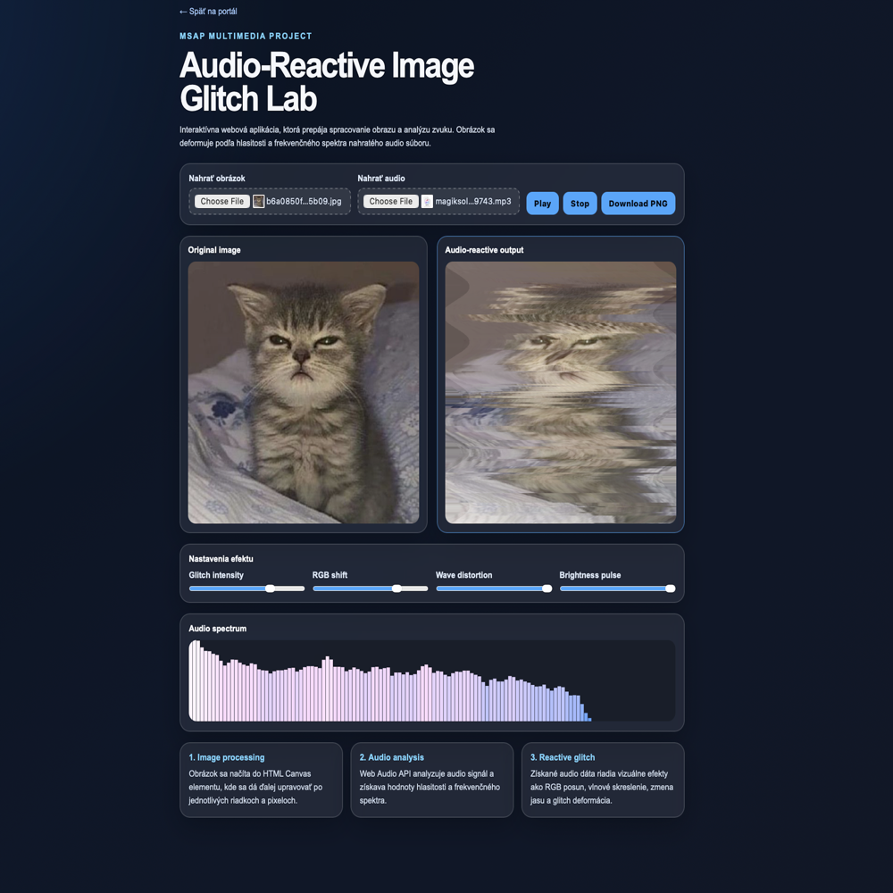

# Audio-Reactive Image Glitch Lab



## Overview

**Audio-Reactive Image Glitch Lab** is an interactive multimedia web application created for the MSAP course.

The application combines image processing, audio analysis, and real-time visual effects. The user can upload an image and an audio file, and the image is dynamically distorted according to the audio signal.

The project runs fully in the browser and does not require any backend server.

---

## Main Idea

The main idea of this project is to show how sound can control visual image deformation.

The uploaded audio file is analyzed in real time using the **Web Audio API**. The extracted frequency and volume data are then used to control visual effects applied to the uploaded image through the **Canvas API**.

```text
Image + Audio Signal -> Audio Analysis -> Reactive Glitch Effect
```

---

## Features

- Upload custom image
- Upload custom audio file
- Play and stop audio
- Real-time audio spectrum visualization
- Audio-reactive image distortion
- Glitch effect
- RGB shift effect
- Wave distortion effect
- Brightness pulse effect
- Adjustable effect intensity
- Export processed image as PNG
- Fully client-side application
- No backend required

---

## Technologies Used

- HTML5
- CSS3
- JavaScript
- Canvas API
- Web Audio API

---

## How It Works

1. The user uploads an image.
2. The image is rendered into an HTML Canvas element.
3. The user uploads an audio file.
4. The audio signal is analyzed directly in the browser.
5. The application extracts frequency and volume information.
6. These audio values control the visual effects applied to the image.
7. The final distorted image can be downloaded as a PNG file.

---

## Audio-Reactive Effects

### Glitch Intensity

Random horizontal parts of the image are shifted according to the current audio volume.

### RGB Shift

The image receives a color-channel displacement effect, which creates a digital glitch look.

### Wave Distortion

The image is distorted using wave-like horizontal movement.

### Brightness Pulse

The brightness of the image changes according to the strength of the audio signal.

### Spectrum Visualization

The frequency spectrum of the uploaded audio is displayed as animated bars.

---

## Project Structure

```text
Audio-Reactive-Image-Glitch-Lab/
├── index.html
├── style.css
├── script.js
├── README.md
├── thumbnail.png
└── .gitignore
```

| File | Description |
|---|---|
| `index.html` | Main HTML structure of the website |
| `style.css` | Visual design and responsive layout |
| `script.js` | Image processing, audio analysis and glitch effects |
| `thumbnail.png` | Project preview image |
| `README.md` | Project documentation |
| `.gitignore` | Ignored system and development files |

---

## How to Open Locally

### Option 1: Download ZIP

1. Open the GitHub repository.
2. Click **Code**.
3. Select **Download ZIP**.
4. Extract the downloaded ZIP file.
5. Open the extracted project folder.
6. Double-click `index.html`.

The project will open in your browser.

---

### Option 2: Clone with Git

Clone the repository:

```bash
git clone https://github.com/bondikk/Audio-Reactive-Image-Glitch-Lab.git
```

Open the project folder:

```bash
cd Audio-Reactive-Image-Glitch-Lab
```

Open the website on macOS:

```bash
open index.html
```

On Windows, open `index.html` manually by double-clicking the file.

No installation, backend server, or additional dependencies are required.

---

## How to Use

1. Open `index.html` in a web browser.
2. Click **Nahrať obrázok** and upload an image.
3. Click **Nahrať audio** and upload an audio file.
4. Press **Play**.
5. Adjust the effect sliders:
   - Glitch intensity
   - RGB shift
   - Wave distortion
   - Brightness pulse
6. Press **Stop** to stop playback.
7. Press **Download PNG** to save the processed image.

---

## Recommended Input Files

### Image

Recommended image formats:

- PNG
- JPG
- JPEG
- WEBP

The application works best with colorful images, portraits, posters, or high-contrast pictures.

### Audio

Recommended audio formats:

- MP3
- WAV
- OGG
- M4A

The best result is achieved with short audio files that have a clear rhythm, bass, or dynamic changes.

---

## Browser Support

The project should work in modern browsers that support Canvas API and Web Audio API:

- Google Chrome
- Microsoft Edge
- Safari
- Firefox

For the best result, Google Chrome or Safari is recommended.

---

## Educational Purpose

This project demonstrates several multimedia processing concepts:

- image rendering in canvas;
- basic real-time image manipulation;
- audio frequency analysis;
- connection between audio data and visual effects;
- interactive client-side multimedia processing.

The project is suitable as a small experimental web application for multimedia signal and image processing.

---

## Limitations

- The project works only with files uploaded by the user.
- The audio file must be supported by the browser.
- Very large images may reduce performance.
- The exported PNG contains only the current processed image, not animation or video.
- The application does not use backend processing or permanent file storage.


---

## Author

**Anastasiia Bondarenko**

Project created for the **MSAP** course.